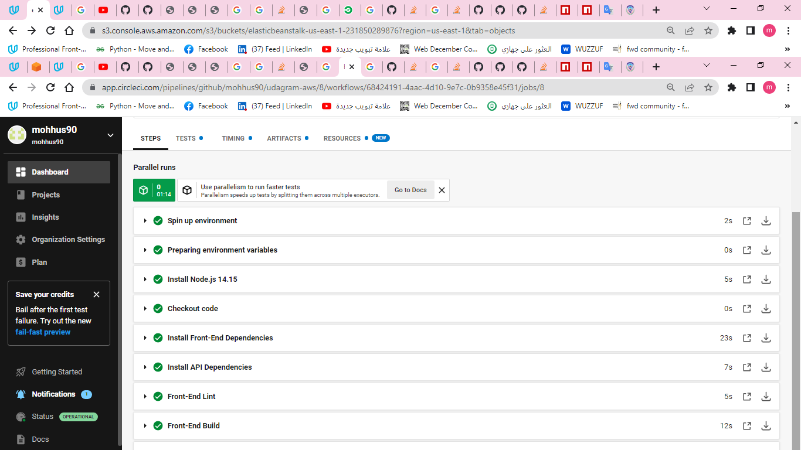

# Pipeline Process

The pipeline is setup and connected with this GitHub repository in CircleCI.

## Order of commands

1. The pipeline uses orbs contain basic recipes and reproducible actions (install node, aws, etc.).
2. install node and checkout code
3. Install Front-End Dependencies
4. Install API Dependencies
5. Front-End Lint
6. Front-End Build
7. API Build
8. Deploy App

## Steps

